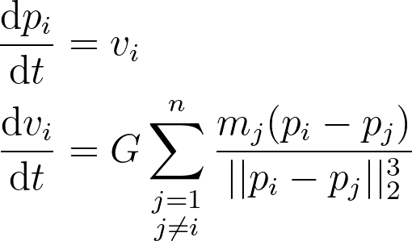
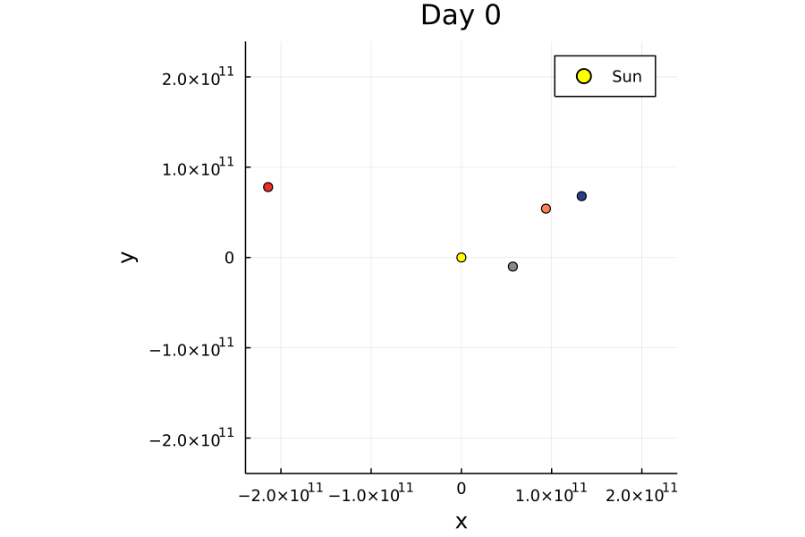

# N Body Problem
The N Body Problem is a model that describes the movement of objects which gravitationally interact with each other. This is either a second order or a system of first order differential equations. I used the latter:



Here ```v``` denotes the velocity, ```p``` the position, ```m``` the mass of each object and ```G``` Newton's gravitational constant. In the denominator is the euklidian norm, hence the 2, to the power of 3 of the positional difference of two objects.

# Example
To put this model to work I used the Euler or Runge-Kutta method to approximate a solution. The initial values are the positions and velocities of our planets with the sun in the middle. You can edit the code to include all 8 (not 9 because Pluto isn't a planet anymore) planets in the calculation but for this GIF I only used 4 planets. It looks like this:


